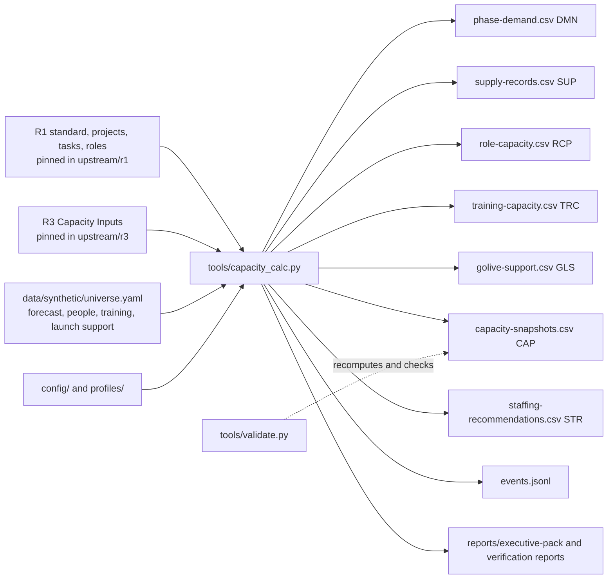

# Architecture

R2 is a small, file-based reference model: YAML configuration and inputs, a deterministic Python calculator, CSV and JSONL outputs validated against JSON Schemas, and generated Markdown reports. There is no database, server, spreadsheet, or language model.

## Data flow

## Layers

| Layer | Files | Owner |
|---|---|---|
| Pinned upstream contracts | `upstream/`, `standard/standard-reference.yaml` | R1 and R3; copied byte for byte by `tools/sync_upstream.py` from an explicit full commit |
| Configuration | `config/*.yaml`, `profiles/*.yaml` | R2; every number labeled |
| Hand-authored synthetic inputs | `data/synthetic/universe.yaml` | R2 |
| Calculation | `tools/capacity_calc.py` | R2 |
| Generated outputs | `data/synthetic/*.csv`, `events.jsonl`, the five reports, three verification reports | Generated only |
| Contracts | `schemas/*.schema.json` | R2 |
| Checks | `tools/validate.py`, `tests/` | R2 |

## Entities and prefixes

All R2 IDs use prefixes registered to R2 in shared standard 1.0.0. R2 adds no prefix.

| Prefix | Entity | v0.1 |
|---|---|---|
| `CAP` | capacity snapshot | used |
| `DMN` | demand record | used |
| `SUP` | supply record | used |
| `RCP` | role capacity | used |
| `STG` | staffing trigger | used (configuration) |
| `STR` | staffing recommendation | used |
| `ORG` | organization profile | used (profiles) |
| `TRD` | training demand | used (R4 interface fixtures) |
| `TRC` | training capacity | used |
| `GLS` | launch-support demand | used |
| `BLD` | builder capacity | reserved, unused in v0.1; no entity is invented to consume it |
| `CTS` | cost-to-serve record | reserved, unused in v0.1; no `cost_to_serve.computed` event is produced |

Scenarios use R1's `SCN` prefix, people `PER`, roles `ROL`, projects `PRJ`, and profiles of complexity `PRF`, all owned by R1.

## Events

R2 produces only registered R2 events, with exactly the ten shared event fields and the catalog's payload fields: `org_profile.selected`, `training_capacity.computed`, `golive_support.computed`, `capacity.snapshot_computed`, `staffing_trigger.fired`, `staffing_recommendation.recorded`. System events use the rule or record that produced them as actor; organization-profile selections use the named person. Every event uses the fixed `calculation_as_of_at` time except human selections, which keep the time the person selected the profile.

## Determinism

- Decimal arithmetic, half-up rounding to `hours_decimal_places` and `ratio_decimal_places`.
- One fixed calculation time from `config/parameters.yaml`; no clock.
- Sorted iteration everywhere; IDs assigned in a fixed order.
- `python tools/capacity_calc.py --check` exits non-zero if any committed output differs from a fresh run; validator check V39 does the same.

## Future extensibility

Weekly periods, actual supply, cost-to-serve, builder capacity, executive metric registrations, and a generated spreadsheet are planned for later versions. Each would add records or fields; none would change the meaning of a v0.1 field.
